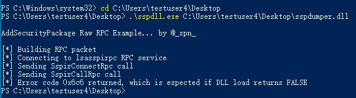

项目中分为两个VS2019解决方案：

- sspdll https://gist.github.com/xpn/c7f6d15bf15750eae3ec349e7ec2380e
- sspdumper dll工程，用来dump内存

使用方法, SYSTEM权限下执行：

然后在C:\WINDOWS\TEMP下找到temp.bin文件，该文件就是lsass.exe进程的内存dump

注意两点：

- sspdll.exe              有时候可能需要源码免杀
- sspdumper.dll      需要填写绝对路径